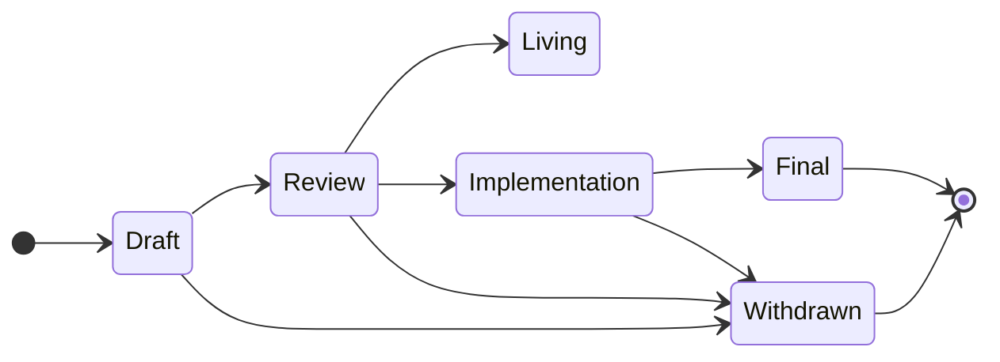

## Abstract

This SIP specified the process of working with proposals inside this repository.
The goals of the process is participate with the community, but in a structured, engineering-focused, way.

### Language

The key words "MUST", "MUST NOT", "REQUIRED", "SHALL", "SHALL NOT",
"SHOULD", "SHOULD NOT", "RECOMMENDED", "NOT RECOMMENDED", "MAY", and
"OPTIONAL" written in uppercase in this document are to be interpreted as described in [RFC 2119](https://www.ietf.org/rfc/rfc2119.txt)

## Workflow

> A good starting point for a new SIP is the [SIP template](../sip-template.md).

### Stages



- **Draft** - The initial SIP status, indicating that it is in development. The SIP will be merged into the repository after being properly formatted. Major changes to the contents of the SIP are expected.
- **Review** - The SIP author(s) marked this SIP as ready for peer review. All members of community are encouraged to participate. Incremental changes to the contents of the SIP are expected.
- **Implementation** - This SIP is being implemented. Only critical changes based on implementation experience are expected.
- **Final** - The SIP is considered a final standard. No further updates except errata and clarifications will be considered. The SIP MUST be fully implemented before being considered for this status.
- **Withdrawn** - The proposed SIP has been withdrawn by the SIP author(s) or will not be considered for inclusion. This status is final. If the idea is to be pursued again, a new proposal MUST be created.
- **Living** - SIPs with this special status are considered continually updated and never final. Such SIPs MUST include the `updated` property in their front-matter. Specifically this includes [SIP-1](./sip-1.md).

## SIP Header Preamble

Each SIP MUST begin with a header preamble in YAML format, preceded and followed by `---`. Such header is termed as [Front Matter by Jekyll](https://jekyllrb.com/docs/front-matter/). The headers MUST appear in following order:

- `sip` - A unique number identifying the SIP, assigned by the SIP editors.
- `title` - A descriptive name for the SIP.
- `status` - The current status of the SIP. One of stages as described [above](#stages).
- `discussions-to` - (Optional) A URL where discussions and review of the specified SIP can be found.
- `author` - The list of authors in format described [below](#author-header).
- `created` - The date the SIP was created on.
- `updated` - (Optional) The date the SIP was updated on. SIPs with status `Living` MUST have this header.

All dates in the preamble MUST be in [ISO 8601](https://en.wikipedia.org/wiki/ISO_8601) format.

#### `author` header

A comma-separated list of the SIP authors. Each author MUST be written in the following format: `Name Surname <email> (@github-username)`. If the author wants to maintain anonymity, they MAY provide only the username instead of their name and surname. The e-mail and github username are optional and MAY be provided. At least one of the authors MUST have a Github username provided in order to be notified of the changes concerning their SIP.

Example `author` header:

`John F. Kowalsky <john.kowalsky@domain.com> (@kowalsky), Gregory House, Anon (@anon)`

## Additional files

The SIP MAY include additional files such as images and diagrams. Such files MUST be placed in `assets` folder in the following location `assets/SIP/sip-N/` where `N` is the SIP's number. When linking to files from SIPs, relative links MUST be used, such as `[schema](../assets/sip/sip-1/schema.json)`.

## Validation

Every SIP MUST pass automatic validation when added in a pull request. You can manually use the validation tool as follows:

```bash
cd tools/validate
yarn install
yarn build
yarn validate '../../SIPS/**'
```

## SIP Editors

The role of SIP repository editors is to enforce the inclusion process. They do not judge the proposals on it's merits, it is up to the community to discuss.

The current SIP editors, sorted alphabetically, are:

- Christian Montoya ([@Montoya](https://github.com/Montoya))
- Hassan Malik ([@hmalik88](https://github.com/hmalik88))
- Olaf Tomalka ([@ritave](https://github.com/ritave))
- Ziad Saab ([@ziad-saab](https://github.com/ziad-saab))

At least one of the editors has to approve any incoming pull requests that update files in the [SIPs folder](./).

## History

The Snaps Improvement Proposals have been inspired by [EIPs](https://github.com/ethereum/EIPs), [CAIPs](https://github.com/ChainAgnostic/CAIPs) and [TC39 Stages](https://tc39.es/process-document/).

## Copyright

Copyright and related rights waived via [CC0](../LICENSE).
