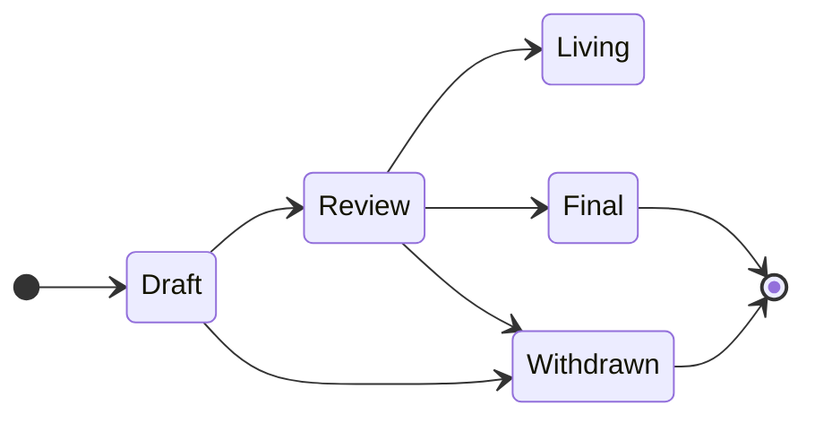

## Abstract

### Language

The key words "MUST", "MUST NOT", "REQUIRED", "SHALL", "SHALL NOT",
"SHOULD", "SHOULD NOT", "RECOMMENDED", "NOT RECOMMENDED", "MAY", and
"OPTIONAL" written in uppercase in this document are to be interpreted as described in [RFC 2119](https://www.ietf.org/rfc/rfc2119.txt)

## Categories

- **Core** - Used to describe improvments in the Core Specification
- **Blockchain** - Used to describe improvements in the Blockchain Specification
- **Meta** - Used to describe the processes of SIP and Specification themselves

## Workflow

### Stages

- **Draft** - First formally tracked status and marks the SIP as in development. The SIP will be merged into the repository after being properly formatted.
- **Review** - SIP author(s) mark this SIP as ready for and requesting peer review
- **Final** - The SIP is considered a final standard. No further updates except errata and clarifications will be considered. The SIP MUST be implemented in at least one client before being considered for this status. After achieving this status, the SIP will be implemented in the next revision of the Specification.
- **Withdrawn** - The proposed SIP has been widthdrawn by the SIP author(s) or will not be considered for inclusion in the specification. This status is final, if the idea is to be pursued again, it should be considered a new proposal.
- **Living** - SIPs with this special status are considered continually updated and never final. Such SIP MUST include `updated` property in the front-matter. Specifically this includes [SIP-1](./sip-1.md)

## SIP Editors

The current SIP editors, sorted alphabetically, are:

- Erik Marks ([@rekmarks](https://github.com/rekmarks))
- Olaf Tomalka ([@ritave](https://github.com/ritave))

## History

The Snaps Improvement Proposals have been insipired by [EIPs](https://github.com/ethereum/EIPs), [CAIPs](https://github.com/ChainAgnostic/CAIPs) and [TC39 Stages](https://tc39.es/process-document/)

## Copyright

Copyright and related rights waived via [CC0](../LICENSE).
