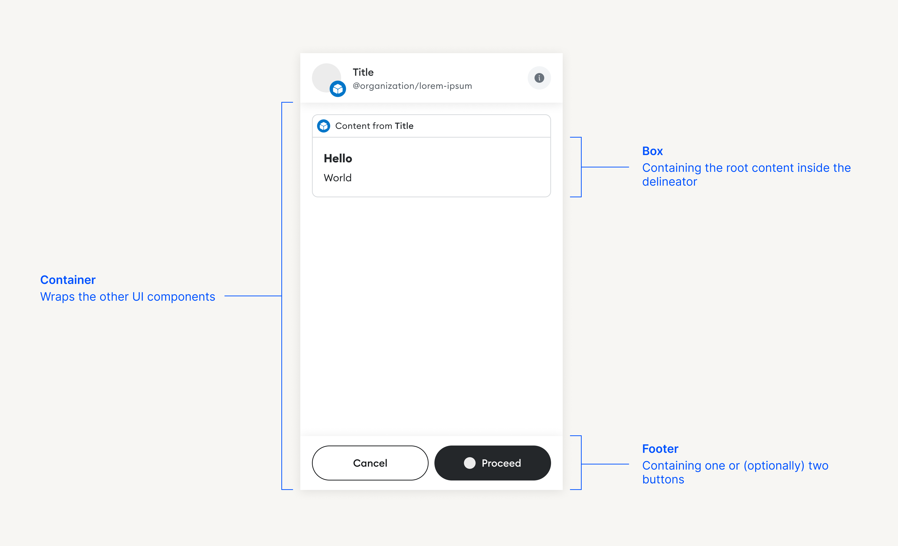

## Abstract

This proposal presents a specification for the use of JSX (JavaScript XML) in
Snap interfaces. It includes a set of definitions, components, and rules for
usage. The document delves into the details of various components such as
`SnapElement`, `SnapComponent`, and `SnapNode`. It also elaborates on specific
elements like , `Address`, `Bold`, `Button`, and `Text` among others, explaining
their structure and purpose.

Moreover, the proposal takes into account backward compatibility considerations.
It outlines a systematic approach to translate the components from the previous
SIP-7 format into the newly proposed format.

The proposal aims to create a more robust, flexible, and versatile system for
Snap interfaces. It strives to enhance the user experience and improve the
efficiency of the system by offering a structured and standardised component
framework.

## Motivation

The motivation behind this proposal is to leverage JSX, a popular syntax
extension for JavaScript, for designing and implementing Snap interfaces. JSX
offers several advantages that make it a preferred choice among developers.
Primarily, it allows for writing HTML-like syntax directly in the JavaScript
code, which makes it more readable and intuitive. This facilitates easier
development and maintenance of complex UI structures.

Furthermore, JSX is universally recognised and widely adopted in the JavaScript
community, especially within the React ecosystem. By using JSX for Snap
interfaces, we enable a vast number of developers familiar with this syntax to
contribute effectively in a shorter time frame.

Adopting JSX also ensures better integration with modern development tools and
practices. It allows for integration with linters, formatters, and type
checkers, thus improving the development workflow.

In summary, the use of JSX in Snap interfaces aims to improve developer
experience, enhance code maintainability, and ultimately, lead to the creation
of more robust and efficient Snap interfaces.

## Specification

> Formal specifications are written in TypeScript.

### Language

The key words "MUST", "MUST NOT", "REQUIRED", "SHALL", "SHALL NOT", "SHOULD",
"SHOULD NOT", "RECOMMENDED", "NOT RECOMMENDED", "MAY", and "OPTIONAL" written in
uppercase in this document are to be interpreted as described in
[RFC 2119](https://www.ietf.org/rfc/rfc2119.txt).

### Definitions

#### Key

A JSX key-like value, i.e., a `string`, `number`, or `null`.

```typescript
type Key = string | number | null;
```

#### SnapElement

A rendered JSX element, i.e., an object with a `type`, `props`, and `key`.

```typescript
type SnapElement<Props = any> = {
  type: string;
  props: Props;
  key: Key;
};
```

#### SnapComponent

A JSX component, i.e., a function which accepts `props`, and returns a
`SnapElement`. All components MUST accept a `key` property in addition to the
regular props.

```typescript
type SnapComponent<Props = Record<string, never>> =
  (props: Props & { key: Key }) => SnapElement<Props>;
```

#### SnapNode

A rendered JSX node, i.e., a `SnapElement`, `string`, `null`, or an array of
`SnapNode`s. Note that HTML elements are not supported in Snap nodes.

```typescript
type SnapNode =
  | SnapElement
  | string
  | null
  | SnapNode[];
```

### Interface structure

The Snap interface structure is defined using JSX components, and consists of:

- A container element, `Container`, which wraps the entire interface.
- A box element, `Box`, which contains the main content of the interface.
- An optional footer element, `Footer`, which appears at the bottom of the
  interface.



#### Example

Below is an example of a simple Snap interface structure using JSX components:

```typescript jsx
<Container>
  <Box>
    <Heading>My Snap</Heading>
    <Text>Hello, world!</Text>
  </Box>
  <Footer>
    <Button onClick={handleClick}>Click me</Button>
  </Footer>
</Container>
```

Each of the components used in the example is defined in the following sections.

### Components

#### Address

The `Address` component renders a text element with an address. It accepts an
`address` prop which is a string representing an Ethereum address.

```typescript
type AddressProps = {
  address: `0x${string}`;
};

const Address: SnapComponent<AddressProps>;
```

##### Example

```typescript jsx
<Address address="0x4bbeEB066eD09B7AEd07bF39EEe0460DFa261520" />
```

#### Bold

The `Bold` component renders a text element in bold. It accepts a `children`
prop which can be a `string` or an array of `string`s. The component MUST be
used inside a `Text` component.

```typescript
type BoldProps = {
  children: string | string[];
};

const Bold: SnapComponent<BoldProps>;
```

##### Example

```typescript jsx
<Text>
  Hello, <Bold>world</Bold>!
</Text>
```

#### Box

The `Box` component renders a box element. It accepts a `children` prop which
can be a `SnapNode`. The component is used to group elements together.

In addition, the component accepts an optional `alignment` prop which can be
`'start'`, `'center'`, `'end'`, or `undefined`. The default value is
`undefined`.

```typescript
type BoxProps = {
  children: SnapNode;
  alignment?: 'start' | 'center' | 'end' | undefined;
};

const Box: SnapComponent<BoxProps>;
```

##### Example

```typescript jsx
<Box alignment="center">
  <Text>Hello, world!</Text>
</Box>
```

#### Button

The `Button` component renders a button element. It accepts a `children` prop
which can be a `string` or an array of `string`s. The component also accepts
optional `type`, `variant`, and `onClick` props. The `type` prop MUST be one of
`'button'`, `'submit'`, or `undefined`. The `variant` prop MUST be one of
`'primary'`, `'secondary'`, or `undefined`. The `onClick` prop is a function to
be called when the button is clicked.

```typescript
type ButtonProps = {
  children: string | string[];
  type?: 'button' | 'submit' | undefined;
  variant?: 'primary' | 'secondary' | undefined;
  onClick?: (() => void) | undefined;
};

const Button: SnapComponent<ButtonProps>;
```

##### Example

```typescript jsx
<Button type="submit" variant="primary" onClick={handleClick}>Click me</Button>
```

#### Container

The `Container` component renders a container element. It accepts a `children`
prop which can be a tuple of `BoxElement` and `FooterElement` or a single
`BoxElement`.

```typescript
type ContainerProps = {
  children: [
    BoxElement,
    FooterElement
  ] | [
    BoxElement
  ]
};

const Container: SnapComponent<ContainerProps>;
```

##### Example

```typescript jsx
<Container>
  <Box>
    <Text>Hello, world!</Text>
  </Box>
  <Footer>
    <Button onClick={handleClick}>Click me</Button>
  </Footer>
</Container>
```

#### Copyable

The `Copyable` component renders a text element with a copy button. It accepts a
`value` prop which is a string to be copied to the clipboard when the button is
clicked. The component also accepts an optional `sensitive` prop which can be
used to indicate that the value is sensitive and should be obscured when
displayed.

```typescript
type CopyableProps = {
  value: string;
  sensitive?: boolean | undefined;
};

const Copyable: SnapComponent<CopyableProps>;
```

##### Example

```typescript jsx
<Copyable value="0x4bbeEB066eD09B7AEd07bF39EEe0460DFa261520" />
<Copyable value="my-secret-key" sensitive />
```

#### Divider

The `Divider` component renders a horizontal line. It does not accept any props.

```typescript
const Divider: SnapComponent;
```

##### Example

```typescript jsx
<Divider />
```

#### Field

The `Field` component renders a field element. It accepts a `label` prop which
is a string representing the field label, and a `children` prop which can be an
input element, and an optional button element. The component also accepts an
`error` prop which is a string representing an error message.

```typescript
type FieldProps = {
  label: string;
  error?: string | undefined;
  children: [InputElement, ButtonElement] | InputElement;
};
```

##### Example

```typescript jsx
<Field label="Name">
  <Input type="text" />
  <Button onClick={handleClick}>Action</Button>
</Field>
```

#### Footer

The `Footer` component renders a footer element. It accepts a `children` prop
which can be one or two buttons.

```typescript
type FooterProps = {
  children: ButtonElement | [ButtonElement, ButtonElement];
};

const Footer: SnapComponent<FooterProps>;
```

##### Example

```typescript jsx
<Footer>
  <Button onClick={handleCancel}>Cancel</Button>
  <Button onClick={handleConfirm}>Confirm</Button>
</Footer>

<Footer>
  <Button onClick={handleAction}>Action</Button>
</Footer>
```

#### Form

The `Form` component renders a form element. It accepts a `children` prop which
can be one or more field elements. The component also accepts an optional
`onSubmit` prop which is a function to be called when the form is submitted,
passing the form data as an object.

```typescript
type FormProps = {
  children: FieldElement | FieldElement[];
  onSubmit?: ((formData: Record<string, string>) => void) | undefined;
};
```

##### Example

```typescript jsx
<Form onSubmit={handleSubmit}>
  <Field label="Name">
    <Input type="text" />
  </Field>
</Form>
```

#### Heading

The `Heading` component renders a heading element. It accepts a `children` prop
which can be a `string` or an array of `string`s.

```typescript
type HeadingProps = {
  children: string | string[];
};

const Heading: SnapComponent<HeadingProps>;
```

##### Example

```typescript jsx
<Heading>My Snap</Heading>
```

#### Image

The `Image` component renders an image element. It accepts a `src` prop which is
a string representing the image source. The component also accepts an optional
`alt` prop which is a string representing the image description.

The `src` MUST be an SVG string. Other image formats are not supported, but
PNG and JPEG images MAY be used inside the SVG as data URIs.

```typescript
type ImageProps = {
  src: string;
  alt?: string | undefined;
};

const Image: SnapComponent<ImageProps>;
```

##### Example

```typescript jsx
<Image src="<svg>...</svg>" alt="My image" />
```

#### Input

The `Input` component renders an input element. It accepts a `name` prop which
is a string representing the input name, a `type` prop which is a string
representing the input type, and an optional `value` prop which is a string
representing the input value. The component also accepts an optional
`placeholder` prop which is a string representing the input placeholder, and an
optional `onChange` prop which is a function to be called when the input value
changes.

The `type` MUST be one of `'text'`, `'password'`, or `'number'`.

```typescript
type InputProps = {
  name: string;
  type: 'text' | 'password' | 'number';
  value?: string | undefined;
  placeholder?: string | undefined;
  onChange?: ((value: string) => void) | undefined;
};

const Input: SnapComponent<InputProps>;
```

##### Example

```typescript jsx
<Input name="name" type="text" placeholder="Enter your name" onChange={handleChange} />
```

#### Italic

The `Italic` component renders a text element in italic. It accepts a `children`
prop which can be a `string` or an array of `string`s. The component MUST be
used inside a `Text` component.

```typescript
type ItalicProps = {
  children: string | string[];
};

const Italic: SnapComponent<ItalicProps>;
```

##### Example

```typescript jsx
<Text>
  Hello, <Italic>world</Italic>!
</Text>
```

#### Link

The `Link` component renders a link element. It accepts a `children` prop which
can be a `string` or an array of `string`s, and an `href` prop which is a string
representing the link URL.

The `href` MUST be an absolute URL. Relative URLs are not supported. It MUST
start with `https://` or `mailto:`.

```typescript
type LinkProps = {
  children: string | string[];
  href: string;
};

const Link: SnapComponent<LinkProps>;
```

##### Example

```typescript jsx
<Link href="https://example.com">Visit example.com</Link>
```

#### Row

The `Row` component renders a key-value pair element. It accepts a `label` prop
which is a string representing the key, and a `children` prop which can be an
address, image, or text element.

In addition, the component accepts an optional `variant` prop which can be
`'default'`, `'warning'`, or `'error'`. The default value is `'default'`.

```typescript
type RowProps = {
  label: string;
  children: AddressElement | ImageElement | TextElement;
  variant?: 'default' | 'warning' | 'error';
};

const Row: SnapComponent<RowProps>;
```

##### Example

```typescript jsx
<Row label="Address">
  <Address address="0x4bbeEB066eD09B7AEd07bF39EEe0460DFa261520" />
</Row>
```

#### Spinner

The `Spinner` component renders a spinner element. It does not accept any props.

```typescript
const Spinner: SnapComponent;
```

##### Example

```typescript jsx
<Spinner />
```

#### Stack

The `Stack` component renders the children elements stacked horizontally. It
accepts a `children` prop which can be one or more `SnapNode`s.

```typescript
type StackProps = {
  children: SnapNode;
};

const Stack: SnapComponent<StackProps>;
```

##### Example

```typescript jsx
<Stack>
  <Image src="<svg>...</svg>" alt="Ethereum icon" />
  <Text>Ethereum</Text>
</Stack>
```

#### Text

The `Text` component renders a text element. It accepts a `children` prop which
can be a `string`, bold, italic, link element, or an array of these elements.

In contrast to SIP-7, the `Text` component does NOT support Markdown syntax. The
`Bold`, `Italic`, and `Link` components MAY be used to achieve similar effects.

```typescript
type TextChild = string | BoldElement | ItalicElement | LinkElement;
type TextProps = {
  children: TextChild | TextChild[];
};

const Text: SnapComponent<TextProps>;
```

#### Fragments

JSX has a feature called fragments that allow multiple children to be grouped
together without adding an extra DOM element. In Snap interfaces, fragments can
be used to group multiple elements together. Since Snap interfaces aren't
rendered to a DOM directly, fragments SHOULD be rendered as box elements.

```typescript jsx
// This JSX element...
<>
  <Text>Hello, world!</Text>
  <Button onClick={handleClick}>Click me</Button>
</>

// ...is equivalent to
<Box>
  <Text>Hello, world!</Text>
  <Button onClick={handleClick}>Click me</Button>
</Box>
```


### JSX runtime

The JSX runtime is a set of functions that are used to render JSX elements,
typically provided by a library like React. Since Snap interfaces are rendered
in a custom environment, the JSX runtime MUST be provided by the Snaps platform.

The Snaps JSX runtime only supports the modern JSX factory functions, i.e.,
`jsx` and `jsxs`. The runtime MUST NOT support the legacy `createElement` and
`Fragment` functions.

Both the `jsx` and `jsxs` functions MUST return a `SnapElement`.

## Backward compatibility

To ensure backward compatibility with the previous SIP-7 format, the legacy
components MUST be translated into the new JSX format.

This SIP does not cover the translation process in detail, but simply outlines
the components and rules for usage in the new format. All features and
functionalities of the previous format are supported in the new format, so
existing Snap interfaces can be easily translated into the new format.

Most components in the new format have a one-to-one correspondence with the
components in the previous format. The `Text` component in the new format
replaces the Markdown syntax in the previous format, and the `Bold`, `Italic`,
and `Link` components can be used to achieve similar effects. The `Box`
component in the new format replaces the `panel` component in the previous
format.

## Copyright

Copyright and related rights waived via [CC0](../LICENSE).
