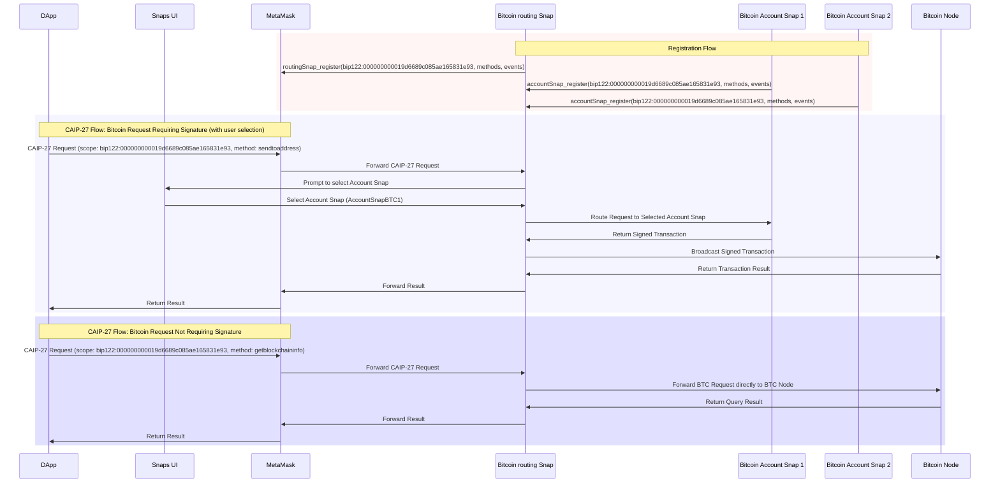

---

sip: 25
title: Standard Interface for RPC routing Snaps
status: Draft
discussions-to: https://github.com/MetaMask/SIPs/discussions/145
author: Alex Donesky (@adonesky1)
created: 2024-07-29
---

## Abstract

This SIP proposes a minimum standard interface for RPC routing Snaps, which will act as intermediaries between the MetaMask wallet and account Snaps (TODO: add account snaps SIP link here when complete). These routing Snaps will handle registration of account Snaps and interpret incoming [CAIP-27](https://github.com/ChainAgnostic/CAIPs/blob/main/CAIPs/caip-27.md) requests, determining whether they require signature and routing them to the appropriate account Snap for signature when applicable. They will broadcast signed transactions to the matching network and return results to MetaMask.


## Motivation

The integration of MetaMask's MultiChain API and protocol Snaps necessitates a standardized approach for routing RPC requests across various blockchain networks. By establishing a standard interface for RPC routing Snaps, we aim to abstract the complexity of non-EVM protocol support away from the MetaMask engineering team, ensuring a seamless and scalable interaction model for decentralized applications (dApps). Because MetaMask is not equipped to interpret requests from non-EVM networks and, for instance, identify which of these requests require signatures or, for methods that do require signatures, which parameters correspond to the account that should sign a transaction, the RPC routing Snap will provide logic for interpreting and routing these requests accordingly.

This approach allows for greater flexibility and extensibility, enabling the MetaMask ecosystem to support a wide range of blockchain networks without requiring changes to the core wallet functionality.

This SIP outlines the key responsibilities and minimum interface requirements for RPC routing Snaps, enabling developers to build and deploy routing Snaps for specific blockchain networks.

## Specification

### Overview

RPC routing Snaps will serve as intermediaries for specific [CAIP-2](https://github.com/ChainAgnostic/CAIPs/blob/main/CAIPs/caip-2.md) identifiers, registering themselves with MetaMask and managing account Snap registrations for their respective networks. They will interpret CAIP-27 requests targeting non-EVM networks made to their registered CAIP-2 identifier, route these requests, facilitate user-specified account Snap options for signing requests, and broadcast signed transactions to the network.

### Key Responsibilities

1. **Registration with MetaMask**:
   - RPC routing Snaps must register with MetaMask for the CAIP-2 identifiers they can serve.

2. **Account Snap Registration**:
   - RPC routing Snaps will expose an interface for account Snaps which serve the same CAIP-2 identifier to register themselves with the routing Snap.
   - Account Snaps must declare the signing methods they support with the routing Snap.

3. **Handling CAIP-27 Requests**:
   - RPC routing Snaps will interpret incoming CAIP-27 requests, identify the network-specific RPC request format, and route to the appropriate account Snap.
   - If the request does not specify an account the routing Snap must provide UI for users to select from among the eligible signer Snaps for signing the request.
   - They will broadcast the signed transactions to the respective blockchain network and return the result to MetaMask.
   - They will also handle requests that do not require signatures by sending them directly to the network and returning the result to MetaMask.

### Minimum Interface for Routing Snaps

#### Registration with MetaMask

- **Method**: `routingSnap_register`
- **Description**: Registers the routing Snap with MetaMask for a specific CAIP-2 identifier(s), specifying the methods and events it can handle.
- **Parameters**:
  - `chains`: An array of CAIP-2 identifiers the Snap can handle.
  - `methods`: An array JSON-RPC methods the Snap supports.
  - `events`: An array of events the Snap can handle.

#### Registering Account Snaps

- **Method**: `accountSnap_register`
- **Description**: Allows account Snaps to register with the routing Snap, specifying the CAIP-2(s) identifier and the methods and events they support.
- **Parameters**:
  - `caip2`:  An array of CAIP-2 identifiers the Snap can handle
  - `methods`: An array of JSON-RPC methods the account Snap supports.
  - `events`: An array of events the account Snap can handle.

#### Handling Requests

- **Method**: `handleCaip27Request`
- **Description**: Interprets and routes CAIP-27 requests to an appropriate account Snap based on the CAIP-2 identifier and method.
- **Parameters**:
  - `scope`: The CAIP-2 identifier of the target chain.
  - `request`: The JSON-RPC request object.
- **Example Implementation**:
  ```typescript
  interface JsonRpcRequest {
  method: string;
  params: any[];
  }

  interface AccountSnap {
    handleRequest(request: JsonRpcRequest): Promise<string>;
  }

  async function handleCaip27Request(scope: string, request: JsonRpcRequest): Promise<string> {
    const { method, params } = request;
    const { requiresSignature, account } = identifySignatureMethods(method, params);

    if (requiresSignature) {
      const accountSnap: AccountSnap | null = await findOrUserSelectAccountSnap(scope, method);
      if (accountSnap) {
        const signedTransaction: string = await accountSnap.handleRequest(request);
        return await broadcastTransaction(signedTransaction);
      } else {
        throw new Error(`No account Snap found for scope: ${scope} and method: ${method}`);
      }
    } else {
      return await sendDirectRequest(method, params);
    }
  }
  ```
- **Error Handling**: The method should include appropriate error handling and return clear error messages for scenarios such as unsupported methods, network issues, or signature failures.

### Detailed Functionality

1. **RPC routing Snap Registration**:
   - RPC routing Snaps register with MetaMask via `routingSnap_register`,
     specifying the CAIP-2 identifier(s) they can handle and the methods/events
     they support.
   - MetaMask maintains a registry of all RPC routing Snaps and their capabilities.

2. **Account Snap Registration**:
   - Account Snaps register with RPC routing Snaps using `accountSnap_register`, declaring their supported CAIP-2 identifiers, methods, and events.
   - RPC routing Snaps maintain a registry of account Snaps and their capabilities.

3. **Handling CAIP-27 Requests**:
   - When MetaMask receives a CAIP-27 request, it validates the request and forwards it to the appropriate RPC routing Snap based on the CAIP-2 identifier.
   - The RPC routing Snap interprets the request and routes it to the appropriate account Snap.
   - If the request requires a signature, the RPC routing Snap either forwards the request to the appropriate account Snap or allows the user to specify which account Snap should handle the request.
   - The signed transaction is then broadcast to the respective blockchain network by the RPC routing Snap.

### Example Workflow for Handling Requests

#### Request Requiring Signature

1. **Receive Request**: MetaMask receives a CAIP-27 request to send Bitcoin (`method: sendtoaddress`).
2. **Identify Method**: The RPC routing Snap identifies that the `sendtoaddress` method requires a signature and doesn't contain the address from which the send should occur.
3. **Route to Account Snap**: The RPC routing Snap routes the request to an eligible Bitcoin account Snap.
4. **Account Snap Signs**: The account Snap signs the transaction and sends the signed transaction back to the RPC routing Snap.
5. **Broadcast Transaction**: The RPC routing Snap broadcasts the signed transaction to the Bitcoin network.
6. **Return Result**: The RPC routing Snap returns the result to MetaMask, which forwards it to the dApp.

```json
{
  "id": 1,
  "jsonrpc": "2.0",
  "method": "wallet_invokeMethod",
  "params": {
    "scope": "bip122:000000000019d6689c085ae165831e93", // Bitcoin Mainnet
    "request": {
      "method": "sendtoaddress",
      "params": [
        "1BitcoinAddress",
        0.1,
        "donation",
        "seans outpost"
      ]
    }
  }
}
```

**Note:** Implementing proper security measures, such as validating the origin of requests and ensuring secure communication between Snaps, is crucial for maintaining the integrity of the system.

#### Request Not Requiring Signature

1. **Receive Request**: MetaMask receives a CAIP-27 request to get the blockchain info (`method: getblockchaininfo`).
2. **Identify Method**: The RPC routing Snap identifies that the `getblockchaininfo` method does not require a signature.
3. **Send Direct Request**: The RPC routing Snap sends the request directly to the Bitcoin node.
4. **Return Result**: The RPC routing Snap returns the result to MetaMask, which forwards it to the dApp.

```json
{
  "id": 1,
  "jsonrpc": "2.0",
  "method": "wallet_invokeMethod",
  "params": {
    "scope": "bip122:000000000019d6689c085ae165831e93", // Bitcoin Mainnet
    "request": {
      "method": "getblockchaininfo",
      "params": []
    }
  }
}
```

### Diagram



## Backwards Compatibility

This proposal introduces new Snap interfaces and does not break existing functionality. It builds upon the CAIP-25 and CAIP-27 standards, ensuring seamless integration with the MultiChain API. Existing dApps and Snaps that do not utilize these new interfaces will continue to function as before.

## Copyright

Copyright and related rights waived via [CC0](../LICENSE).
