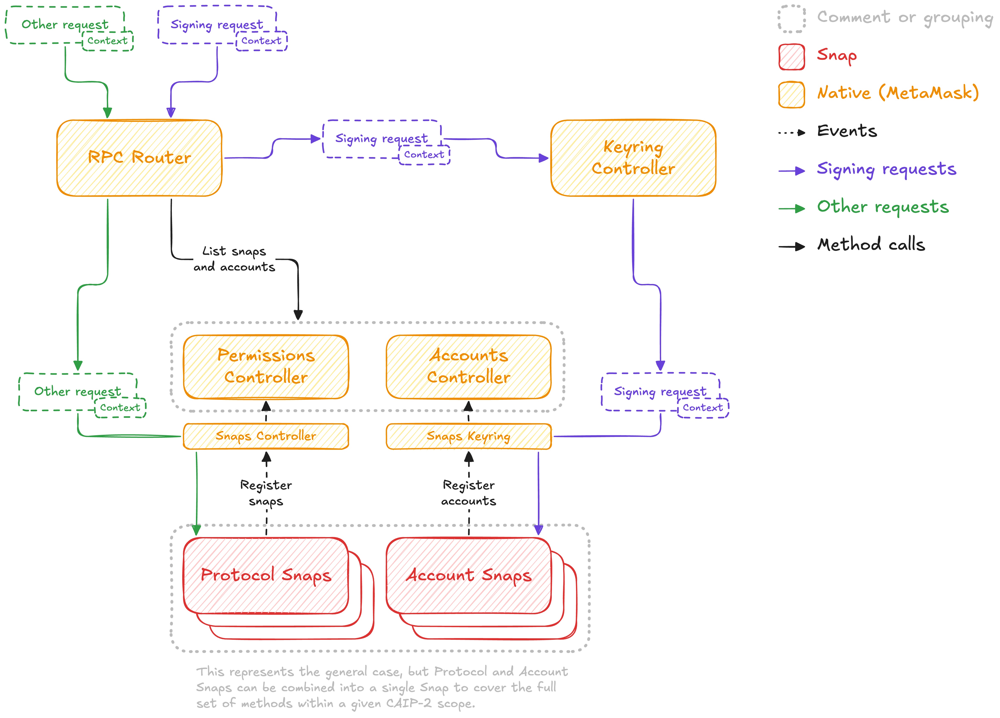

## Abstract

This SIP proposes a new API to be implemented by a new Account Router, allowing
the forwarding of signing requests to the appropriate account Snap (i.e., Snaps
that implement the [Keyring API][keyring-api]).

## Motivation

The Keyring API is being modified to support non-EVM chains. However, a
challenge arises in identifying the correct account Snap that should receive
the signing request, as this information is often only obtainable from the
request itself, which varies based on the method and chain.

## Specification

> Formal specifications are written in TypeScript.

### Language

The key words "MUST", "MUST NOT", "REQUIRED", "SHALL", "SHALL NOT", "SHOULD",
"SHOULD NOT", "RECOMMENDED", "NOT RECOMMENDED", "MAY", and "OPTIONAL" written
in uppercase in this document are to be interpreted as described in [RFC
2119](https://www.ietf.org/rfc/rfc2119.txt).

### High-Level architecture

The diagram below represents a high-level architecture of how the Account
Router integrates with the RPC Router, Account Snaps, and Protocol Snaps.



- **Account Snaps**: Snaps that implement the Keyring API and are responsible
  for signing requests and managing accounts.

- **Protocol Snaps**: Snaps that implement protocol methods that do not require
  an account to be executed.

- **RPC Router**: Native component that forwards non-signing requests to the
  appropriate Protocol Snap or native implementation.

- **Account Router**: Native component that forwards signing requests to the
  appropriate Account Snap or native implementation.

- **Account Address Resolution Snaps**: Snaps that implement the
  `resolveAccountAddress` method to extract the account address from the
  request object.


### RPC Router

The RPC Router is a native wallet component responsible for routing RPC requests made via the Multichain API to either a Protocol Snap or the Account Router, depending on whether the requested method is registered as a signing method or not.

#### Role and Functioning

- **Initial Request Handling**: Receives all incoming RPC requests made via the Multichain API that do not have an `eip155` namespace. For now, `eip155` scoped requests will continue to be handled by the native wallet, though we will need to consider how to allow users to decide whether to route these requests to snaps as well in the future.

- **Method Registration**: Provides entry points for the Account Router and Protocol Snaps to register their methods, method signatures, and scopes, and maintains a registry of these RPC methods and their respective handlers.

- **Request Routing**: Uses the internal registry to determine the correct handler for each incoming RPC request based on the method name, method signatures, and scope strings, forwarding the request to either the Account Router or the appropriate Protocol Snap.

#### Interface

The RPC Router provides a method for registering RPC methods with their scopes and handler. Both the Account Router and Protocol Snaps use this method to inform the RPC Router about the methods they can handle. The origin of the `rpcRouter_registerMethods` call, either a specific protocol snap (e.g., `npm:@solana/example-protocol-snap`) or the Account Router (which will use its own internal registry to forward to the appropriate Account Snaps), is used to determine which handler the method will be registered with.

To ensure that incoming requests are handled correctly, methods are registered along with their method signatures using OpenRPC schema notation. When a request is received, the RPC Router compares the request's parameters against the registered method signatures to find a matching handler. This ensures that the request parameters are valid and that the correct handler processes the request.

Multiple handlers can register for the same method with the same or different method signatures. In such cases, the RPC Router will select the appropriate handler based on the method signature that matches the request's parameters. This allows for flexibility in handling methods that may have overloaded signatures or that can be processed by different handlers depending on the parameter types.

##### Registration Process

Protocol Snaps register their methods, method signatures, and scopes during initialization (obtained from their manifest file) or when their capabilities change. Account Snaps register their signing methods with the Account Router, which then registers them with the RPC Router. The RPC Router maintains an internal registry mapping methods, method signatures, and scopes to their respective handlers.


##### Specification

```typescript
import { MethodObject } from "@open-rpc/meta-schema";

function rpcRouter_registerMethods(
  methods: MethodObject[],
  scopeStrings: ScopeString[]
): void;
```

##### Example Usage

```typescript

import { MethodObject } from "@open-rpc/meta-schema";

// Account Router registering methods for Solana with OpenRPC method definitions
rpcRouter_registerMethods(
  [
    {
      name: "signTransaction",
      params: [
        {
          name: "transaction",
          required: true,
          schema: { type: "string", format: "base64" },
        },
      ],
      result: {
        name: "signedTransaction",
        schema: { type: "string", format: "base64" },
      },
    },
    {
      name: "signMessage",
      params: [
        {
          name: "message",
          required: true,
          schema: { type: "string" },
        },
      ],
      result: {
        name: "signedMessage",
        schema: { type: "string", format: "base64" },
      },
    },
  ],
  ["solana"]
);

// A Protocol Snap registering non-signing methods for Solana with OpenRPC method definitions
rpcRouter_registerMethods(
  [
    {
      name: "getAccountInfo",
      params: [
        {
          name: "publicKey",
          required: true,
          schema: { type: "string", format: "publicKey" },
        },
      ],
      result: {
        name: "accountInfo",
        schema: { type: "object" },
      },
    },
    {
      name: "getBalance",
      params: [
        {
          name: "publicKey",
          required: true,
          schema: { type: "string", format: "publicKey" },
        },
      ],
      result: {
        name: "balance",
        schema: { type: "number" },
      },
    },
    {
      name: "getRecentBlockhash",
      params: [],
      result: {
        name: "blockhash",
        schema: { type: "string" },
      },
    },
  ],
  ["solana"]
);
```

##### Example Registry

The following is an example of a registry that includes methods registered by both the Account Router and Protocol Snaps for different chains and namespaces, including their method signatures.

```typescript
import { MethodObject } from "@open-rpc/meta-schema";

type RpcMethodRegistry = {
  [scope: string]: {
    [methodName: string]: Array<{
      methodSignature: MethodObject;
      handlerIds: string[];
    }>;
  };
};

const rpcMethodRegistry: RpcMethodRegistry = {
  solana: {
    signTransaction: [
      {
        methodSignature: {
          name: "signTransaction",
          params: [
            {
              name: "transaction",
              required: true,
              schema: { type: "string", format: "base64" },
            },
          ],
          result: {
            name: "signedTransaction",
            schema: { type: "string", format: "base64" },
          },
        },
        handlerIds: ["AccountRouter"],
      },
      // Other implementations of solana:signTransaction can be added here
    ],
    signMessage: [
      {
        methodSignature: {
          name: "signMessage",
          params: [
            {
              name: "message",
              required: true,
              schema: { type: "string" },
            },
          ],
          result: {
            name: "signedMessage",
            schema: { type: "string", format: "base64" },
          },
        },
        handlerIds: ["AccountRouter"],
      },
    ],
    getAccountInfo: [
      {
        methodSignature: {
          name: "getAccountInfo",
          params: [
            {
              name: "publicKey",
              required: true,
              schema: { type: "string", format: "publicKey" },
            },
          ],
          result: {
            name: "accountInfo",
            schema: { type: "object" },
          },
        },
        handlerIds: ["npm:@example/solana-protocol-snap"],
      },
      {
        methodSignature: {
          name: "getAccountInfo",
          params: [
            {
              name: "accountId",
              required: true,
              schema: { type: "string" },
            },
          ],
          result: {
            name: "accountInfo",
            schema: { type: "object" },
          },
        },
        handlerIds: ["npm:@yet-another/solana-protocol-snap"],
      },
    ],
    // ... more methods
  },
  "bip122:000000000019d6689c085ae165831e93": {
    // Bitcoin Mainnet
    sendtoaddress: [
      {
        methodSignature: {
          name: "sendtoaddress",
          params: [
            {
              name: "address",
              required: true,
              schema: { type: "string" },
            },
            {
              name: "amount",
              required: true,
              schema: { type: "number" },
            },
          ],
          result: {
            name: "transactionId",
            schema: { type: "string" },
          },
        },
        handlerIds: ["AccountRouter"],
      },
      // Other implementations of sendtoaddress can be added here
    ],
    getblockchaininfo: [
      {
        methodSignature: {
          name: "getblockchaininfo",
          params: [],
          result: {
            name: "info",
            schema: { type: "object" },
          },
        },
        handlerIds: ["npm:@example/bitcoin-protocol-snap"],
      },
      {
        methodSignature: {
          name: "getblockchaininfo",
          params: [
            {
              name: "verbosity",
              required: false,
              schema: { type: "number" },
            },
          ],
          result: {
            name: "info",
            schema: { type: "object" },
          },
        },
        handlerIds: ["npm:@another/bitcoin-protocol-snap"],
      },
    ],
    // ... more methods
  },
  cosmos: {
    cosmos_signTransaction: [
      {
        methodSignature: {
          name: "cosmos_signTransaction",
          params: [
            {
              name: "signDoc",
              required: true,
              schema: { type: "object" },
            },
          ],
          result: {
            name: "signedTransaction",
            schema: { type: "string" },
          },
        },
        handlerIds: ["AccountRouter"],
      },
    ],
    abci_query: [
      {
        methodSignature: {
          name: "abci_query",
          params: [
            { name: "path", required: true, schema: { type: "string" } },
            { name: "data", required: true, schema: { type: "string" } },
            { name: "height", required: false, schema: { type: "number" } },
            { name: "prove", required: false, schema: { type: "boolean" } },
          ],
          result: {
            name: "response",
            schema: { type: "object" },
          },
        },
        handlerIds: ["npm:@cosmos/general-protocol-snap"],
      },
    ],
    // ... more methods
  },
  // ... more chains and methods
};
```

#### Request Handling Flow

When the wallet receives a [CAIP-27][caip-27] request via the Multichain API, the RPC Router processes it through the following steps:

1. **Extract Request Details**: Parses the request to identify the method name, parameters, and scope (chain or namespace). The scope is determined using [CAIP-2][caip-2] identifiers.

2. **Check Namespace**: Determines if the request has an `eip155` namespace (Ethereum-based chains). If it does, the request is handled natively by the wallet; otherwise, it is forwarded to the RPC Router.

3. **Lookup Handler**: If the request does not have an `eip155` namespace, the RPC Router checks its registry to find handlers for the method and scope. It then matches the incoming request's parameters against the registered method signatures.

4. **Determine Handler Type**:

   - **Protocol Snap**: If the method is registered with a Protocol Snap and the method signature matches the request parameters, the request is forwarded to it.
   - **Account Router**: If the method is registered with the Account Router and the method signature matches the request parameters, the request is forwarded to it.
   - **Unregistered Method**: If the method is not registered or no method signatures match the request parameters, an error is returned to the requester.

5. **Forward Request**: The RPC Router forwards the request to the identified handler.

6. **Return Response**: The handler processes the request and returns a response, which the RPC Router then returns back to the Multichain API RPC pipeline to be returned to the requester.


### Account Router

The Account Router exposes the [`snap_manageAccounts`][snap-manage-accs] method
to allow account Snaps to register, remove, and update accounts.

For example, this code can be used by an Account Snap to register a new account
with the Account Router:

```typescript
// This will notify the Account Router that a new account was created, and the
// Account Router will register this account as available for signing requests
// using the `eth_signTypedData_v4` method.
await snap.request({
  method: "snap_manageAccounts",
  params: {
    method: "notify:accountCreated",
    params: {
      account: {
        id: "74bb3393-f267-48ee-855a-2ba575291ab0",
        type: "eip155:eoa",
        address: "0x1234567890123456789012345678901234567890",
        methods: ["eth_signTypedData_v4"],
        options: {},
      },
    },
  },
});
```

Similar events are available to notify about the removal and update of
accounts: `notify:accountRemoved` and `notify:accountUpdated`.

Additionally, the Account Router expects the Account Snap to implement the
Keyring API so it can forward signing requests to it through the
[`keyring_submitRequest`][submit-request] method.

### Account Address Resolution Snaps

The Account Address Resolution Snaps are responsible for extracting the account
address that should receive the signing request from the request object. This
is accomplished by exposing the `resolveAccountAddress` method to the Account
Router.

```typescript
/**
 * Returns the address of the account that should handle the signing request.
 *
 * @param request - The request object.
 * @returns The account address or `undefined` if the address could not be
 * resolved.
 */
function resolveAccountAddress(request: MultichainRequest): string | undefined;
```

There must be only one Account Resolution Snap registered per chain to prevent
ambiguity in the account resolution process.

To identify which Account Resolution Snap should be used for a given request,
Account Address Resolution Snaps MUST list the supported chains in their
manifest file using the [CAIP-2][caip-2] format for chain IDs:

```json5
"initialPermissions": {
  "endowment:account-address-resolver": {
    "chains": [
      "<chain_id_1>",
      "<chain_id_2>",
      // ...
    ]
  }
}
```

Note that the `reference` part of the [CAIP-2][caip-2] chain ID can be a `*`
wildcard to match any chain ID of a given namespace (e.g., `eip155:*`).

The RPC Router subscribes to Snap installation events to detect new Account
Address Resolution Snaps and updates its internal routing table accordingly.

### Protocol Snaps

Protocol Snaps implement and expose methods that do not require an account to
execute and MUST list their supported methods in their manifest file:

```json5
"initialPermissions": {
  "endowment:protocol-methods": {
    "chains": {
      "<chain_id_1>": [
        // List of supported methods
      ]
    }
  }
}
```

The RPC Router subscribes to Snap installation events to detect new Protocol
Snaps and updates its internal routing table accordingly.

> [!IMPORTANT]
> If a method, for a given chain, is registered by both a Protocol Snap and the
> Accounts Router, only the Accounts Router will be used to handle requests for
> that method and chain.

### Context object

Alongside the request object, a context object is passed along to keep internal
state related to the request. Its structure is not defined by this SIP, but a
primary use would be to keep the resolved account ID.

## Copyright

Copyright and related rights waived via [CC0](../LICENSE).

[keyring-api]: https://github.com/MetaMask/accounts/tree/main/packages/keyring-api
[snap-manage-accs]: https://docs.metamask.io/snaps/reference/snaps-api/#snap_manageaccounts
[submit-request]: https://docs.metamask.io/snaps/reference/keyring-api/account-management/#keyring_submitrequest
[caip-2]: https://github.com/ChainAgnostic/CAIPs/blob/main/CAIPs/caip-2.md
[caip-27]: https://github.com/ChainAgnostic/CAIPs/blob/main/CAIPs/caip-27.md
[caip-217]: https://github.com/ChainAgnostic/CAIPs/blob/main/CAIPs/caip-217.md
