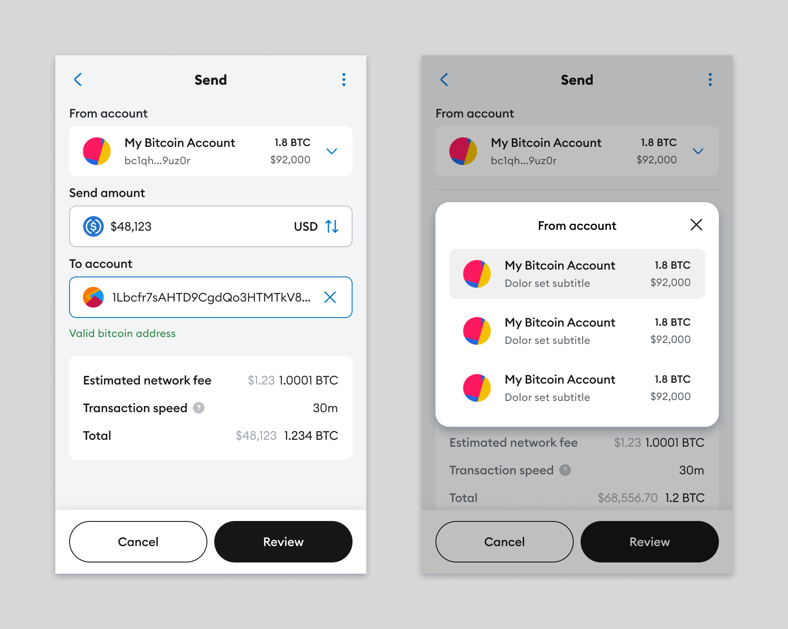

## Abstract

This SIP allows Snaps to retrieve metadata related to accounts that exist in the extension.

## Motivation

The intention of this SIP is to allow Snaps providing new accounts for new chains to be able to list all accounts when selecting one during transfers. Currently the Snap can only access their own accounts, and can't do more complex UI flows.

The specific need for this SIP is to allow a Snap to create a send flow with an account picker, with an example design as follows.



## Specification

> Indented sections like this are considered non-normative.

> Usage of `CAIP-N` specifications, where `N` is a number, are references to [Chain Agnostic Improvement Proposals](https://github.com/ChainAgnostic/CAIPs).

### Language

The key words "MUST", "MUST NOT", "REQUIRED", "SHALL", "SHALL NOT",
"SHOULD", "SHOULD NOT", "RECOMMENDED", "NOT RECOMMENDED", "MAY", and
"OPTIONAL" written in uppercase in this document are to be interpreted as described in [RFC 2119](https://www.ietf.org/rfc/rfc2119.txt)

### Snap Manifest

This SIP specifies a permission named `keyring_listAccountsAll`. This permission grants a Snap the ability to retrieve account metadata through an RPC call.

The permission is specified in `snap.manifest.json` as follows:

```json
{
  "initialPermissions": {
    "keyring_listAccountsAll": {}
  }
}
```

### RPC Method

This SIP exposes a new RPC method called `keyring_listAccountsAll` with no additional parameters.

The RPC call returns with the following data:

````typescript
type KeyringAccount = {
  /**
   * An extension-specific unique ID providing stable identity.
   */
  id: string;
  /**
   * Account addresses mapped by CAIP-2 namespace or chain ID.
   *
   * If the address is the same for all CAIP-2 chains, it's mapped only by namespace.
   * @example
   * ```typescript
   * address: {
   *   'eip155': ['0x1234...']
   * }
   * ```
   *
   * Otherwise, if the address differs between chains, it's mapped by chain IDs.
   * @example
   * ```typescript
   * address: {
   *   'eip155:1': ['0x1234...'],
   *   'eip155:137': ['0x6789...']
   * }
   * ```
   */
  address: Record<string, string[]>;
  /**
   * User-given nickname for the account in the extension.
   */
  name: string;
};

type Keyring_ListAccountsAllResult = KeyringAccount[];
````

> Notice that multiple `Account`s can have the same `address`, for example when there are two hardware wallets using the same seed.

The call returns data concerning all accounts available in the client, both built-in Ethereum accounts as well as accounts managed by this, and other Snaps.

## Copyright

Copyright and related rights waived via [CC0](../LICENSE).
