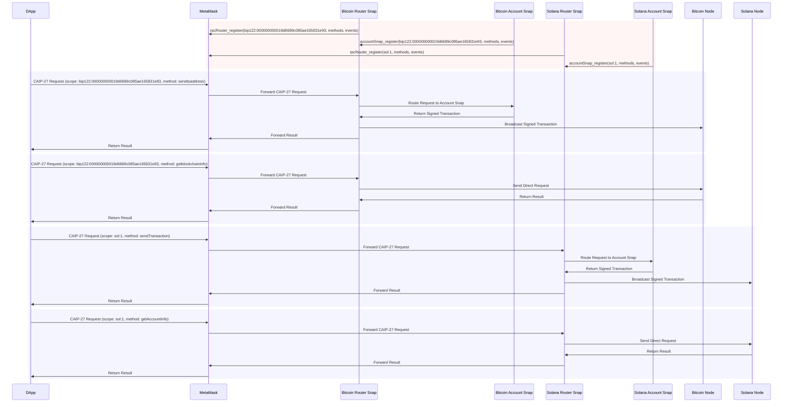

---

sip: x
title: Standard Interface for RPC Router Snaps
status: Draft
discussions-to: TBD
author: Alex Donesky (@adonesky1)
created: 2024-07-29
---

## Abstract

This SIP proposes a minimum standard interface for RPC router Snaps, which will act as intermediaries between the MetaMask wallet and account Snaps (TODO: add account snaps SIP link here when complete). These routing Snaps will handle registration of account Snaps and interpret incoming CAIP-27 requests, determining whether they require signature and routing them to the appropriate account Snap for signature when applicable. They will broadcast signed transactions to the matching network and return results to MetaMask.

## Motivation

The integration of MetaMask's MultiChain API and protocol Snaps necessitates a standardized approach for routing RPC requests across various blockchain networks. By establishing a standard interface for RPC router Snaps, we aim to abstract the complexity of non-EVM protocol support away from the MetaMask engineering team, ensuring a seamless and scalable interaction model for decentralized applications (dApps). Because MetaMask is not equipped to interpret requests from non EVM networks and, for instance, identify which requests require signatures or, for methods that do require signatures, which parameters correspond to the account that should sign a transaction, the RPC router Snap will provide logic for interpreting and routing these requests accordingly.

This SIP outlines the key responsibilities and minimum interface requirements for RPC router Snaps, enabling developers to build and deploy routing Snaps for specific blockchain networks.

## Specification

### Overview

RPC router Snaps will serve as intermediaries for specific CAIP-2 identifiers, registering themselves with MetaMask and managing account Snap registrations for their respective networks. They will interpret non-EVM CAIP-27 requests made to their registred CAIP-2 identifier, route these requests, facilitate user-specified account Snap options for signing requests, and broadcast signed transactions to the network.

### Key Responsibilities

1. **Registration with MetaMask**:
   - RPC router Snaps must register with MetaMask for the CAIP-2 identifiers they can serve.

2. **Account Snap Registration**:
   - RPC router Snaps will expose an interface for account Snaps to register themselves based on matching CAIP-2 identifiers.
   - Account Snaps must declare the signing methods they support with the router Snap.

3. **Handling CAIP-27 Requests**:
   - RPC router Snaps will interpret incoming CAIP-27 requests, identify the network-specific RPC request format, and route to the appropriate account Snap.
   - If the request does not specify an account the router snap must provide UI for users to select from among the eligible signer Snaps for signing the request.
   - They will broadcast the signed transactions to the respective blockchain network and return the result to MetaMask.
   - They will also handle requests that do not require signatures by sending them directly to the network and returning the result to MetaMask.

### Minimum Interface for Routing Snaps

#### Registration with MetaMask

- **Method**: `rpcRouter_register`
- **Description**: Registers the routing Snap with MetaMask for a specific CAIP-2 identifier, specifying the methods and events it can handle.
- **Parameters**:
  - `caip2`: The CAIP-2 identifier the Snap can handle.
  - `methods`: A list of JSON-RPC methods the Snap supports.
  - `events`: A list of events the Snap can handle.

#### Registering Account Snaps

- **Method**: `accountSnap_register`
- **Description**: Allows account Snaps to register with the routing Snap, specifying the CAIP-2 identifier and the methods and events they support.
- **Parameters**:
  - `caip2`: The CAIP-2 identifier the account Snap can handle.
  - `methods`: A list of JSON-RPC methods the account Snap supports.
  - `events`: A list of events the account Snap can handle.

#### Handling Requests

- **Method**: `handleCaip27Request`
- **Description**: Interprets and routes CAIP-27 requests to the appropriate account Snap based on the CAIP-2 identifier and method.
- **Parameters**:
  - `scope`: The CAIP-2 identifier of the target chain.
  - `request`: The JSON-RPC request object.
- **Example Implementation**:
  ```javascript
  async function handleCaip27Request(scope, request) {
    const { method, params } = request;
    const { requiresSignature, account } = identifySignatureMethods(method, params);

    if (requiresSignature) {
      const accountSnap = await findOrUserSelectAccountSnap(scope, method);
      if (accountSnap) {
        const signedTransaction = await accountSnap.handleRequest(request);
        return await broadcastTransaction(signedTransaction);
      } else {
        throw new Error(`No account Snap found for scope: ${scope} and method: ${method}`);
      }
    } else {
      return await sendDirectRequest(method, params);
    }
  }
  ```

### Detailed Functionality

1. **RPC Router Snap Registration**:
   - RPC router Snaps register with MetaMask via `rpcRouter_register`, specifying the CAIP-2 identifiers they can handle and the methods/events they support.
   - MetaMask maintains a registry of all RPC router Snaps and their capabilities.

2. **Account Snap Registration**:
   - Account Snaps register with RPC router Snaps using `accountSnap_register`, declaring their supported CAIP-2 identifiers, methods, and events.
   - RPC router Snaps maintain a registry of account Snaps and their capabilities.

3. **Handling CAIP-27 Requests**:
   - When MetaMask receives a CAIP-27 request, it validates the request and forwards it to the appropriate RPC router Snap based on the CAIP-2 identifier.
   - The RPC router Snap interprets the request and routes it to the appropriate account Snap.
   - If the request requires a signature, the RPC router Snap either forwards the request to the appropriate account Snap or allows the user to specify which account Snap should handle the request.
   - The signed transaction is then broadcast to the respective blockchain network by the RPC router Snap.

### Identifying Methods Requiring Signatures

- **Method**: `identifySignatureMethods`
- **Description**: Identifies which JSON-RPC methods require user signatures and routes these requests to the appropriate account Snap.
- **Parameters**:
  - `method`: The JSON-RPC method being requested.
  - `params`: The parameters of the JSON-RPC request.
- **Returns**:
  - `requiresSignature`: A boolean indicating whether the method requires a signature.
  - `account`: The account to be used for signing, if specified.

- **Example Implementation**:
  ```javascript
  function identifySignatureMethods(method, params) {
    const signatureMethods = ["sendtoaddress", "sendmany", "signrawtransactionwithkey"];
    const requiresSignature = signatureMethods.includes(method);
    let account = null;

    if (requiresSignature && params.length > 0) {
      account = params[0]; // Example for extracting the account from parameters
    }

    return { requiresSignature, account };
  }
  ```

### Example Workflow for Handling Requests

#### Request Requiring Signature

1. **Receive Request**: MetaMask receives a CAIP-27 request to send Bitcoin (`method: sendtoaddress`).
2. **Identify Method**: The RPC router Snap identifies that the `sendtoaddress` method requires a signature.
3. **Route to Account Snap**: The RPC router Snap routes the request to the appropriate Bitcoin account Snap.
4. **Account Snap Signs**: The account Snap signs the transaction.
5. **Broadcast Transaction**: The RPC router Snap broadcasts the signed transaction to the Bitcoin network.
6. **Return Result**: The RPC router Snap returns the result to MetaMask, which forwards it to the dApp.

```json
{
  "id": 1,
  "jsonrpc": "2.0",
  "method": "wallet_invokeMethod",
  "params": {
    "scope": "bip122:000000000019d6689c085ae165831e93", // Bitcoin Mainnet
    "request": {
      "method": "sendtoaddress",
      "params": [
        "1BitcoinAddress",
        0.1,
        "donation",
        "seans outpost"
      ]
    }
  }
}
```

#### Request Not Requiring Signature

1. **Receive Request**: MetaMask receives a CAIP-27 request to get the blockchain info (`method: getblockchaininfo`).
2. **Identify Method**: The RPC router Snap identifies that the `getblockchaininfo` method does not require a signature.
3. **Send Direct Request**: The RPC router Snap sends the request directly to the Bitcoin node.
4. **Return Result**: The RPC router Snap returns the result to MetaMask, which forwards it to the dApp.

```json
{
  "id": 1,
  "jsonrpc": "2.0",
  "method": "wallet_invokeMethod",
  "params": {
    "scope": "bip122:000000000019d6689c085ae165831e93", // Bitcoin Mainnet
    "request": {
      "method": "getblockchaininfo",
      "params": []
    }
  }
}
```

### Example Workflow for Solana

#### Request Requiring Signature

1. **Receive Request**: MetaMask receives a CAIP-27 request to send Solana (`method: sendTransaction`).
2. **Identify Method**: The RPC router Snap identifies that the `sendTransaction` method requires a signature.
3. **Route to Account Snap**: The RPC router Snap identifies that the CAIP-27 request does not identify an account to sign and prompts the user to select an account to sign and routes the request to the appropriate Solana account Snap.
4. **Account Snap Signs**: The account Snap signs the transaction and sends the signed transaction back to the RPC router Snap.
5. **Broadcast Transaction**: The RPC router Snap broadcasts the signed transaction to the Solana network.
6. **Return Result**: The RPC router Snap returns the result to MetaMask, which forwards it to the dApp.

```json
{
  "id": 1,
  "jsonrpc": "2.0",
  "method": "wallet_invokeMethod",
  "params": {
    "scope": "sol:1", // Solana Mainnet
    "request": {
      "method": "sendTransaction",
      "params": [
        {
          "recentBlockhash": "5eykt4UsFv8P8NJdTRE4Rkk4L

77eC1HbDRHUfW8rQJxa",
          "signatures": [
            {
              "publicKey": "3No4UR3oHPAbSmQZo3CTsN3tFN6pQ8QyDpXdbFTc6cw2",
              "signature": null
            }
          ],
          "instructions": [
            {
              "programId": "11111111111111111111111111111111",
              "data": "3BxsTbNvQBsMdFNV",
              "keys": [
                {
                  "pubkey": "3No4UR3oHPAbSmQZo3CTsN3tFN6pQ8QyDpXdbFTc6cw2",
                  "isSigner": true,
                  "isWritable": true
                },
                {
                  "pubkey": "4No4UR3oHPAbSmQZo3CTsN3tFN6pQ8QyDpXdbFTc6cw2",
                  "isSigner": false,
                  "isWritable": false
                }
              ]
            }
          ]
        }
      ]
    }
  }
}
```

#### Request Not Requiring Signature

1. **Receive Request**: MetaMask receives a CAIP-27 request to get the Solana account info (`method: getAccountInfo`).
2. **Identify Method**: The RPC router Snap identifies that the `getAccountInfo` method does not require a signature.
3. **Send Direct Request**: The RPC router Snap sends the request directly to the Solana node.
4. **Return Result**: The RPC router Snap returns the result to MetaMask, which forwards it to the dApp.

```json
{
  "id": 1,
  "jsonrpc": "2.0",
  "method": "wallet_invokeMethod",
  "params": {
    "scope": "sol:1", // Solana Mainnet
    "request": {
      "method": "getAccountInfo",
      "params": [
        "3No4UR3oHPAbSmQZo3CTsN3tFN6pQ8QyDpXdbFTc6cw2"
      ]
    }
  }
}
```

### Diagram



## Backwards Compatibility

This proposal introduces new Snap interfaces and does not break existing functionality. It builds upon the CAIP-25 and CAIP-27 standards, ensuring seamless integration with the MultiChain API.

## Copyright

Copyright and related rights waived via [CC0](../LICENSE).
